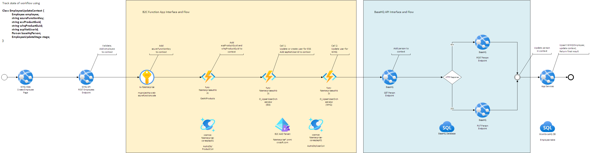

# Create User

## Endpoint
`POST /v{version}/Employees`

## Originating User Story
[#33897: Create User](https://dev.azure.com/fsllc/Portfolio/_workitems/edit/33897)

## Description
This endpoint accepts a payload describing a new user to be added to WorkforceHQ Human Resource Management (HRM) and Employee Self Service (ESS) systems.

The data in the payload must be distributed to several different systems:
- The Azure AD B2C Directory for FSL clients
- The AuthZDb CosmosDb collection describing user product entitlements
- The BaseHQ[^1] database that acts as a central location in HQ Suite for all shared contact data
- The WorkforceHQ database that serves application-specific data to HRM and ESS

[^1]: _At time of writing, the BaseHQ database and API are not complete, and this data lives in the ProjectHQ database with access via the PHQ Projects API._ 

The first two functions are performed by the Azure AD B2C Function App used by FSL's internal Client Permission Center (CPC) tool. The endpoint will take the initial request payload and construct the appropriate request to the B2C function app's Upsert User Orchestrator (UUO) function. 

The last two functions will be handled internally in the WorkforceHQ API. Upon successful creation of a user, WHQ API will call the BaseHQ API and create a Person record with the supplied contact data from the initial request. Upon successful creation of the Person record, WHQ API will create an Employee record in the WHQ database via its direct database connection.

When the workflow is complete, the endpoint will return a response indicating the created ids in each affected system. 

## Flow Diagram



## Flow State Management

As is evident from the diagram above, the Create Employee process is a pipeline not unlike a web request pipeline. We model the process in a similar way with a context object that is passed from stage to stage in the pipeline. 

```csharp
class EmployeeUpdateContext {
	Employee employee;          // WHQ Employee Data Model
	string azureFunctionKey;    // Needed to call Azure B2C Function App, retrieved from Azure Key Vault
	string essProductGuid;      // Needed to call Azure B2C Upsert User Orchestrator, retrieved from Azure B2C GetAllProducts
	string whqProductGuid;      // Needed to call Azure B2C Upsert User Orchestrator and BaseHQ API, retrieved from Azure B2C GetAllProducts
	string userGuid;        // Needed to call BaseHQ API, retrieved from Upsert User Orchestrator
	Person baseHqPerson;        // BaseHQ Person Integration Model; need personId for WHQ Employee record upsert
	EmployeeUpdateStage stage;  // An enum (TBD) indicating the current stage in case of failure, to aid troubleshooting
}
```

## Flow Description

The numbered items below could be used as definitions for the `EmployeeUpdateStage` enum.

On receipt of a Create User request to the POST Employee endpoint, the WHQ API executes the following steps:

1. Validate the payload and, if valid, initialize the `EmployeeUpdateContext` object with an `Employee` model.
2. Retrieve the `myprojecthq-web-azurefunctioncode` secret from the Azure Key Vault, and add it to the `EmployeeUpdateContext`.
3. Call the Azure B2C function app's `GetAllProducts` function, identify the ESS and WHQ product guids, and add them to the `EmployeeUpdateContext`.
4. Call the UUO with `singleClientSpecified` and `singleProductSpecified` equal to `true`, requesting the ESS User role to be added to this user under this client. The operation will return a new or existing `AspNetUserId`, which is to be added to the `EmployeeUpdateContext` as `UserGuid`.
    1. If the user does not exist, the B2C app will create records in Azure AD and the Cosmos AuthzDb.
    2. If the user does exist, the B2C app will add the role to the existing user.
5. Call the UUO with `singleClientSpecified` and `singleProductSpecified` equal to `true` again, this time requesting the WHQ User role and optionally the WHQ Admin role. As the user is guaranteed to exist per step 4, this is always an update.
6. Call the BaseHQ API's GET Person endpoint, passing the `UserGuid` as a query parameter, and examine the response:
    1. (Response 200) If the Person record exists in BaseHQ, add it to the `EmployeeUpdateContext`, and make any changes indicated in the originating request.
    2. (Response 404) If the Person record does not exist in BaseHQ, create a new `Person` integration model object from the originating request, and add it to the `EmployeeUpdateContext`.
7. Create or Update the BaseHQ Person record
    1. if the Person record was found in BaseHQ, call the PUT endpoint with the modified `Person` integation object.
    2. If the Person record was not found in BaseHQ, call the POST endpoint with the new `Person` integration object.
8. Store the returned `Person` object in the `EmployeeUpdateContext` so we can use its `Id` in the next step.
9. Insert or update the `Employee` object in the WorkforceHQ database's Employee table, using the `UserGuid` as `AspNetUserId` and `Person.Id` from the `EmployeeUpdateContext` as references.
10. Return the created or updated `UserGuid`, `PersonId`, and `EmployeeId` to the front-end.

## Request Model

```typescript
{
    honorificId: number, // called Prefix on Create Employee page
    firstName: string,
    middleName: string,
    lastName: string,
    suffix: string,
    email: string,
    phoneNumber: string,
    startDate: Date,
    supervisorId: number,
    additionalSupervisors: number[],
    securedAccess: boolean,
    workLocations: number[],
    permissionGroupId: number,
    initialEmployeeStatusId: number, // 2 = Onboard; 3 = Quick Hire; reject others
    employmentStatusId: number // 1 = Full Time, 2 = Part Time; reject others
}
```

## Request Validation

See [#33897: Create User](https://dev.azure.com/fsllc/Portfolio/_workitems/edit/33897)

## Expected Responses

### 200 OK
The request completed successfully.

The User records have been created in Azure AD and the AuthzDb Cosmos database.

The Person record has been created in the BaseHQ database.

The Employee record has been created in the WorkforceHQ database.

#### Response Model

```typescript
{
    userGuid: string, // id in both AAD B2C and Cosmos
    phqPersonId: number,
    employeeId: number
}
```

#### Sample Response

```typescript
{
    userGuid: 'be8f563a-6477-41da-9911-ed8a24d65887',
    phqPersonId: 505,
    employeeId: 30
}
```

### 401 Unauthorized
The requesting user is not logged in. Either the token is missing or is invalid.

### 403 Forbidden
An attempt to create an admin user was made by a user that was not themselves an admin.

### 409 Conflict
More than one Person row currently exists in BaseHQ under this client for the user account. A single record to update cannot be determined. Call support.

(This would indicate a bad data condition that we would have to resolve)

### 422 Bad request
The request object failed validation. The response should conform to [RFC 7807](https://datatracker.ietf.org/doc/html/rfc7807). 

See [Handle errors in ASP.NET Core Web APIs](https://learn.microsoft.com/en-us/aspnet/core/web-api/handle-errors?view=aspnetcore-6.0) for information on how to generate the response with a `ValidationProblemDetails` object. 

#### Response Model

```typescript
{
    type: string,
    title: string,
    status: number,
    traceId: string,
    errors: { [key: string]: string[] }
}
```

#### Sample Response

```typescript
{
    type: 'https://httpstatuses.com/422'
    title: 'One or more validation errors occurred',
    status: 422,
    traceId: '....'
    errors: {
        firstName: [
            'First Name is required'
        ],
        phoneNumber: [
            'Phone number does not match pattern',
            'Phone number is too long'
        ]
    }
}
```

### 502 Bad Gateway

An upstream call to the UUO or BaseHQ API failed. Details in the Problem document.

#### Sample Response

```typescript
{
    type: 'https://httpstatuses.com/502'
    title: 'BaseHQ PUT call failed with code: 500',
    status: 502,
    traceId: '....'
}
```

## Interfaces

This sections describes the protocols used to communicate with other resources.

### Azure B2C Upsert User Orchestrator (UUO)

The Azure B2C Upsert User Orchestrator function accepts a request to create or update a user along with the user's product access rights.

#### Endpoint

POST `https://authb2c-{env}.foundationsoft.com/api/UpsertUserOrchestration?code={code}&clientId=default`

where:
- env = environment specifier
- code = Azure function code (retrieved from Azure Key Vault)

#### Request Model

```typescript
{
    userFirstName: string,
    userLastName: string,
    userName: string,
    isInternal: boolean,
    userStatusId: number,
    requestedProductGuid: string,
    clients: Array<{
        clientGuid: string,
        products: Array<{
            productGuid: string,
            roles: Array<{
                role: string
            }>
        }>
    }>,
    singleClientSpecified: boolean,
    singleProductSpecified: boolean,
    permissionGroupId: number?
}
```

#### Sample Requests

##### Employee (ESS Access Only)

This is the first access request. We request access to only the ESS product guid, and only the role `WHQESS_User`.

All employees are granted access to ESS, regardless of access to WHQ.

We set both `singleClientSpecified` and `singleProductSpecified` to `true` set this request to "patch" mode. In "patch" mode, the UUO adds the requested client, product, and role to the user entry in Cosmos, if one exists. Otherwise, the UUO creates a new entry in Cosmos.

```typescript
{
    userFirstName: 'Susan',
    userLastName: 'Foreman',
    userName: 'susan.foreman@example.org',
    isInternal: false,
    userStatusId: 1,
    clients: [
        {
            clientGuid: 'cf18873c-652f-4637-b0d8-0781c25ee04d',
            products: [
                {
                    productGuid: '8b6f6c1a-8370-473b-a02c-2840c5ced943',
                    roles: [
                        {
                            role: 'WHQESS_User'
                        }
                    ]
                }
            ]
        }
    ],
    singleClientSpecified: true,
    singleProductSpecified: true
}
```

##### HR Office and Supervisor (ESS Access, non-admin HRM access)

For users that require non-admin login access to the HRM portal (such as HR Office and Supervisor group members), we make a second call to the UUO endpoint, requesting the role `WorkforceHQ_User` on the WHQ product entry.

As before, this request is sent in "patch" mode using the `singleClientSpecified` and `singleProductSpecified` flags set `true`.

This call will follow a successful WHQESS_User role request, and so will always be an update to the Cosmos user record. The UUO will add the contents of the `products` array on the payload to the Cosmos user record.

Note that the distinction between an HR Office user and a Supervisor user is handled by the WHQ permission group. Although there is an optional `/permissionGroupId` on the Upsert User Orchestrator (UUO) function, it is for legacy PHQ security and should be omitted or set null. The UUO function is only responsible for creating a user and updating the user's product entitlements.

```typescript
{
    userFirstName: 'Barbara',
    userLastName: 'Wright',
    userName: 'barbara.wright@example.org',
    isInternal: false,
    userStatusId: 1,
    requestedProductGuid: '89368a9a-30b0-4946-b2b3-74988926314f',
    clients: [
        {
            clientGuid: 'cf18873c-652f-4637-b0d8-0781c25ee04d',
            products: [
                {
                    productGuid: '89368a9a-30b0-4946-b2b3-74988926314f',
                    roles: [
                        {
                            role: 'WorkforceHQ_User'
                        }
                    ]
                }
            ]
        }
    ],
    singleClientSpecified: true,
    singleProductSpecified: true
}
```

##### HR Admin (ESS Access, Admin HRM access)

For users that require admin access to the HRM portal, we make a second call to the UUO endpoint, requesting the roles `WorkforceHQ_User` (granting login) and `WorkforceHQ_Admin` (granting admin rights) on the WHQ product entry.

As before, this request is sent in "patch" mode using the `singleClientSpecified` and `singleProductSpecified` flags set `true`.

This call will follow a successful WHQESS_User role request, and so will always be an update to the Cosmos user record. The UUO will add the contents of the `products` array on the payload to the Cosmos user record.

```typescript
{
    userFirstName: 'Ian',
    userLastName: 'Chesterton',
    userName: 'ian.chesterton@example.org',
    isInternal: false,
    userStatusId: 1,
    requestedProductGuid: '89368a9a-30b0-4946-b2b3-74988926314f',
    clients: [
        {
            clientGuid: 'cf18873c-652f-4637-b0d8-0781c25ee04d',
            products: [
                {
                    productGuid: '89368a9a-30b0-4946-b2b3-74988926314f',
                    roles: [
                        {
                            role: 'WorkforceHQ_User'
                        },
                        {
                            role: 'WorkforceHQ_Admin'
                        }
                    ]
                }
            ]
        }
    ],
    singleClientSpecified: true,
    singleProductSpecified: true
}
```

#### Expected Response

##### 200 OK

The function always returns a 200 OK response, regardless of success or failure. 

The success state can be read from the `/success` key on the response object. 

On success, the `/user` key will contain the details of the upserted user. The user's AAD User guid will be available from the `/id` key.

On a failure, the reason can be read from the `/message` key.

```typescript
{
    user: {
        id: string,
        email: string,
        userName: string,
        firstName: string,
        lastName: string,
        isInternal: string,
        createdOn: Date?,
        isSystemAdmin: boolean,
        accountEnabled: boolean?,
        userStatusId: number
    },
    success: boolean,
    message: string
}
```

### BaseHQ API

See [BaseHQ Endpoints](https://foundationsoftwareinc.sharepoint.com/teams/PeopleHQ-HRWebApp/_layouts/OneNote.aspx?id=%2Fteams%2FPeopleHQ-HRWebApp%2FSiteAssets%2FPeopleHQ%20-%20HR%20Web%20App%20Notebook&wd=target%28Feature%20Design%2FBaseHQ%20Integration.one%7C093BD361-7C03-4CBD-B6AA-68C0BFD2C799%2FBaseHQ%20API%20Endpoints%7C735EA087-C98E-4EC5-85F0-1E5C62572443%2F%29)

#### Endpoints

##### Get Person for Azure AD User Guid

Used to determine if we need to create the BaseHQ Person via POST, or update one via PUT. 

`GET {basehq-url}/v1/People?userGuid={userGuid}`

where:
- basehq-url = the endpoint of the BaseHQ API in the current environment (TBD)
- userGuid = the Azure AD User Guid retrieved from the UUO call

The client id will be on the requesting auth token.

###### Expected Response

Response Code: 200 OK
Response Body: An array of Person models containing matches for the provided user guid.

Array length:

0. No Person found. We must call the POST endpoint to create one.
1. The Person was found. We must patch the returned model and return it to the PUT endpoint to update the record.
2. (or more) Error condition, fail request with 409 response.

This is a documented sample response from BaseHQ.

```typescript
[
{
	"id": 1,
	"clientId": 1,
	"originProductGuid": "89368a9a-30b0-4946-b2b3-74988926314f",
	"userGuid": "89368a9a-30b0-4946-b2b3-77302739276a",
	"active": true,
	"deleted": false,
	"isEmployee": true,
	"suffix": "III",
	"firstName": "Canton",
	"middleName": "Everett",
	"lastName": "Delaware",
	"employeeIdNumber": null,
	"email": {
		"id": 1,
		"email": "xfbi@example.org",
		"emailAddressStatus": 0,
		"changeTrackingDate": "sysstarttime"
	},
	"mainPhone": {
		"id": 1, // PersonPhoneId
        "phoneId": 1, 
        "personId": 1, // Should match top level id
		"phoneNumber": "555-555-5555",
		"isMain": true,
		"allowText": false,
		"phoneExtension": null,
		"personPhoneNumberType": 0,
		"changeTrackingDate": "sysstarttime"
	},
	"addresses": [{
		"id": 1, // PersonAddressId
        "addressId": 1,
        "personId": 1 // Should match top level id
		"address1": "123 Main Street",
		"address2": null,
		"city": "Cleveland",
		"state": "OH",
		"zip": "12345",
		"country": "US",
		"changeTrackingDate": "sysstarttime"
	}],
	"alternatePhones": [{
		"id": 2, // PersonPhoneId
        "phoneId": 2, 
        "personId": 1, // Should match top level id
		"phoneNumber": "555-555-5556",
		"isMain": false,
		"allowText": true,
		"phoneExtension": null,
		"personPhoneNumberType": 2,
		"changeTrackingDate": "sysstarttime"
	}],
	"changeTrackingDate": "sysstarttime"
}]
```

##### Create BaseHQ Person

`POST {basehq-url}/v1/People`

where:
- basehq-url = the endpoint of the BaseHQ API in the current environment (TBD)

The client id will be on the requesting auth token.

###### Request Model

Only data with values from the originating request, or which must be constant for BaseHQ Person creation, are listed here. 

We expect the BaseHQ API to fill in any defaults (such as zeroes, nulls, or empty arrays) according to [Postel's Law](https://en.wikipedia.org/wiki/Robustness_principle), so that we can concentrate on what data is pertinent to our use case.

```typescript
{ 
    clientId: number, 
    originProductGuid: string, // WHQ product guid
    userGuid: string, // AAD User Guid, from UUO
    isEmployee: boolean, // will be hard coded to true
    suffix: string, 
    firstName: string, 
    middleName: string, 
    lastName: string, 
    email: { 
        email: string, 
    }
    mainPhone: {
          isMain: boolean, // hard coded to true 
          phoneNumber: string, 
    }
}
```

###### Sample Request

```typescript
{ 
    clientId: 1, 
    originProductGuid: '89368a9a-30b0-4946-b2b3-74988926314f',
    isEmployee: true,
    suffix: 'III', 
    firstName: 'Canton', 
    middleName: 'Everett', 
    lastName: 'Delaware', 
    email: { 
        email: 'xfbi@example.org', 
    }
    mainPhone: {
          isMain: true, 
          phoneNumber: '330-555-1212', 
    }
}
```

###### Expected Response

Response Code: 200 OK
Response Body: A Person model reflecting the created record.

See [BaseHQ Endpoints](https://foundationsoftwareinc.sharepoint.com/teams/PeopleHQ-HRWebApp/_layouts/OneNote.aspx?id=%2Fteams%2FPeopleHQ-HRWebApp%2FSiteAssets%2FPeopleHQ%20-%20HR%20Web%20App%20Notebook&wd=target%28Feature%20Design%2FBaseHQ%20Integration.one%7C093BD361-7C03-4CBD-B6AA-68C0BFD2C799%2FBaseHQ%20API%20Endpoints%7C735EA087-C98E-4EC5-85F0-1E5C62572443%2F%29)

##### Update BaseHQ Person

`PUT `{basehq-url}/v1/People/{personId}`

where:
- basehq-url = the endpoint of the BaseHQ API in the current environment (TBD)
- personId = the person id to update

The client id will be on the requesting auth token.

###### Request Model

A Person model with the desired updates.

See [BaseHQ Endpoints](https://foundationsoftwareinc.sharepoint.com/teams/PeopleHQ-HRWebApp/_layouts/OneNote.aspx?id=%2Fteams%2FPeopleHQ-HRWebApp%2FSiteAssets%2FPeopleHQ%20-%20HR%20Web%20App%20Notebook&wd=target%28Feature%20Design%2FBaseHQ%20Integration.one%7C093BD361-7C03-4CBD-B6AA-68C0BFD2C799%2FBaseHQ%20API%20Endpoints%7C735EA087-C98E-4EC5-85F0-1E5C62572443%2F%29)

###### Expected Response

Response Code: 200 OK
Response Body: A Person model reflecting the updated record.

See [BaseHQ Endpoints](https://foundationsoftwareinc.sharepoint.com/teams/PeopleHQ-HRWebApp/_layouts/OneNote.aspx?id=%2Fteams%2FPeopleHQ-HRWebApp%2FSiteAssets%2FPeopleHQ%20-%20HR%20Web%20App%20Notebook&wd=target%28Feature%20Design%2FBaseHQ%20Integration.one%7C093BD361-7C03-4CBD-B6AA-68C0BFD2C799%2FBaseHQ%20API%20Endpoints%7C735EA087-C98E-4EC5-85F0-1E5C62572443%2F%29)

## Data Mapping

This section describes the data elements to populate in each system.

### Azure AD B2C Directory

#### Users

|Attribute|Source|Notes|
|---------|------|-----|
|Object ID|*Generated A|The AAD User GUID|
|User Principal Name|email|From originating request payload|
|First Name|firstName|From originating request payload|
|Last Name|lastName|From originating request payload|

### AuthzDb CosmosDb

#### UserColl Collection

|Attribute|Source|Notes|
|---------|------|-----|
|id|*Generated A|The AAD User GUID|
|UserName|email|From originating request payload|
|FirstName|firstName|From originating request payload|
|LastName|lastName|From originating request payload|
|IsInternal|isInternal|From UUO payload, constant `false`|
|UserStatusId|userStatusId|From UUO payload, constant `1` (Active)|
|Clients[x].ClientGuid|clientId|From originating request access token|
|Clients[x].Products[y].ProductGuid|clients[x].products[y].productGuid|From UUO payload
|Clients[x].Products[y].Roles[z].Role|clients[x].products[y].roles[z].role|From UUO payload

### BaseHQ Database

Column default values are not shown unless overridden by the request 

#### Person Table

|Column|Source|Notes|
|------|------|-----|
|PersonId|*Generated P|PK for BaseHQ Person|
|ClientId|FSIClientIds|From originating request access token|
|FirstName|firstName|From originating request payload|
|MiddleName|middleName|From originating request payload|
|LastName|lastName|From originating request payload|
|Suffix|suffix|From originating request payload|
|IsEmployee|`true`|Constant, overrides default value|
|EmailAddressId|*Generated PE|FK to EmailAddress.EmailAddressId|

#### EmailAddress Table

|Column|Source|Notes|
|------|------|-----|
|EmailAddressId|*Generated PE|PK for BaseHQ EmailAddress|
|EmailAddress|email|From originating request|

#### Phone Table

|Column|Source|Notes|
|------|------|-----|
|PhoneId|*Generated PP|PK for BaseHQ Phone|
|IsMain|`true`|Constant, overrides default value|
|PhoneNumber|phone|From originating request|

#### PersonPhone Table

|Column|Source|Notes|
|------|------|-----|
|PersonPhoneId|*Generated PPI|PK for BaseHQ PersonPhone|
|PersonId|*Generated P|FK to BaseHQ Person|
|PhoneId|*Generated PP|FK to BaseHQ Phone|

#### ProductUser Table

|Column|Source|Notes|
|------|------|-----|
|ProductUserGuid|*Generated PU|PK for BaseHQ ProductUser|
|UserGuid|*Generated A|The AAD User GUID|
|PersonId|*Generated P|FK to BaseHQ Person|


### WorkforceHQ Database

#### Employee Table

|Column|Source|Notes|
|------|------|-----|
|EmployeeId|*Generated E|PK for WorkforceHQ Employee|
|PHQPersonId|*Generated P|Reference to BaseHQ Person|
|AspNetUserId|*Generated A|The AAD User GUID|
|PHQClientId|FSIClientIds|From originating request access token|
|PermissionGroupId|permissionGroupId|From originating request|
|EmployeeStatusId|initialEmployeeStatusId|From originating request - FK to WorkforceHQ shared.EmployeeStatus|
|IsSecuredAccess|securedAccess|From originating request|
|HonorificId|honorificId|From originating request - FK to WorkforceHQ shared.Honorific|
|UpdateEmployeeId|UserInformation.EmployeeId|From UserInformation middleware|

#### dbo.EmployeeSupervisor Table

|Column|Source|Notes|
|------|------|-----|
|EmployeeSupervisorId|*Generated ES|PK for dbo.EmployeeSupervisor|
|PHQClientId|FSIClientIds|From originating request access token|
|SupervisorEmployeeId|supervisorId / additionalSupervisors[x]|FK to dbo.Employee table|
|EmployeeId|*Generated E|FK to dbo.Employee table|
|IsReportingSupervisor|`true` or `false`|`true` for the primary supervisorId on the originating request|
|UpdateEmployeeId|UserInformation.EmployeeId|From UserInformation middleware|

#### dbo.EmployeeEmployment

|Column|Source|Notes|
|------|------|-----|
|EmployeeEmploymentId|*Generated EE|PK for dbo.EmployeeEmployment|
|PHQClientId|FSIClientIds|From originating request access token|
|EmployeeId|*Generated E|FK to dbo.Employee table|
|EmploymentStatusId|employmentStatusId|From originating request - FK to WorkforceHQ shared.EmploymentStatus|
|DateHired|startDate|From originating request|
|UpdateEmployeeId|UserInformation.EmployeeId|From UserInformation middleware|

#### dbo.EmployeePayrollStateTaxCodeWorkLocation

|Column|Source|Notes|
|------|------|-----|
|EmployeePayrollStateTaxCodeWorkLocation|*Generated EPT|PK for dbo.EmployeePayrollStateTaxCodeWorkLocation|
|PHQClientId|FSIClientIds|From originating request access token|
|EmployeeId|*Generated E|FK to dbo.Employee|
|PayrollStateTaxCodeId|workLocations[x]|From originating request - FK to WorkforceHQ dbo.PayrollStateTaxCode|
|UpdateEmployeeId|UserInformation.EmployeeId|From UserInformation middleware|
